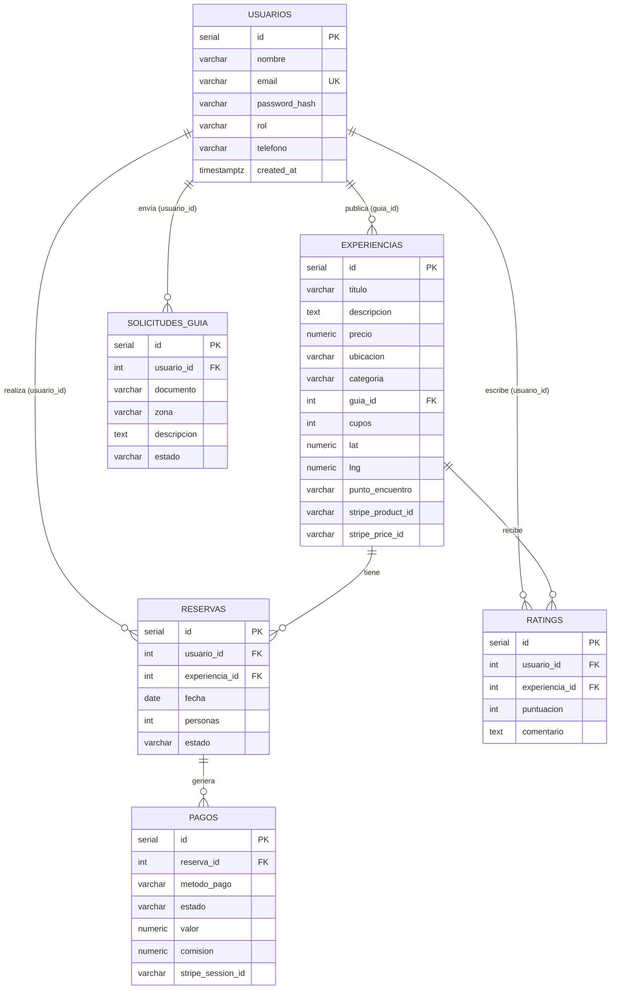

# 🗄️ Entregable — Base de Datos

**Integrante:** Andres Rangel
**Rol:** Modelado de datos y administración de la base de datos
**Proyecto:** Muelle Digital

---

## 1. Tecnología

- **Motor:** PostgreSQL (relacional).
- **Hosting:** **NeonDB** (PostgreSQL serverless, plan gratuito, con endpoint *pooler* para entornos serverless).
- **Acceso desde el backend:** driver `pg` (node-postgres) con **consultas parametrizadas** (previene inyección SQL).
- **Script de esquema:** `backend/database/schema.sql` · **datos de ejemplo:** `seed.sql` · **migrador:** `migrate.js` (`npm run db:setup`).

---

## 2. Diagrama Entidad–Relación



---

## 3. Relaciones

| Relación | Cardinalidad | Regla |
|----------|--------------|-------|
| usuarios → experiencias | 1 : N | Un guía publica muchas experiencias |
| usuarios → reservas | 1 : N | Un turista hace muchas reservas |
| experiencias → reservas | 1 : N | Una experiencia tiene muchas reservas |
| usuarios → ratings | 1 : N | Un usuario escribe muchas reseñas |
| experiencias → ratings | 1 : N | **Única** por (usuario, experiencia) |
| reservas → pagos | 1 : N | Una reserva puede tener intentos de pago |
| usuarios → solicitudes_guia | 1 : N | Un usuario puede postularse |

Todas las claves foráneas usan **`ON DELETE CASCADE`**: al borrar un usuario o experiencia se eliminan sus datos dependientes (integridad referencial).

---

## 4. Diccionario de datos

### Tabla `usuarios`
| Campo | Tipo | Restricciones | Descripción |
|-------|------|---------------|-------------|
| id | SERIAL | PK | Identificador |
| nombre | VARCHAR(120) | NOT NULL | Nombre completo |
| email | VARCHAR(160) | UNIQUE, NOT NULL | Correo (login) |
| password_hash | VARCHAR(255) | NOT NULL | Contraseña encriptada (bcrypt) |
| rol | VARCHAR(20) | CHECK (turista/guia/admin) | Rol del usuario |
| telefono | VARCHAR(30) | — | Teléfono de contacto |
| created_at | TIMESTAMPTZ | DEFAULT NOW() | Fecha de registro |

### Tabla `experiencias`
| Campo | Tipo | Restricciones | Descripción |
|-------|------|---------------|-------------|
| id | SERIAL | PK | Identificador |
| titulo | VARCHAR(160) | NOT NULL | Nombre del tour |
| descripcion | TEXT | NOT NULL | Detalle |
| precio | NUMERIC(10,2) | CHECK ≥ 0 | Precio por persona (COP) |
| ubicacion | VARCHAR(160) | NOT NULL | Zona |
| temporada | VARCHAR(80) | — | Temporada recomendada |
| categoria | VARCHAR(80) | — | Tipo de experiencia |
| guia_id | INTEGER | FK → usuarios | Guía dueño |
| cupos | INTEGER | CHECK ≥ 0 | Cupos totales |
| imagen | VARCHAR(500) | — | URL de imagen |
| lat / lng | NUMERIC(9,6) | — | Coordenadas del punto de encuentro |
| punto_encuentro | VARCHAR(200) | — | Nombre del punto |
| stripe_product_id | VARCHAR(80) | — | Producto en Stripe |
| stripe_price_id | VARCHAR(80) | — | Precio en Stripe |
| created_at | TIMESTAMPTZ | DEFAULT NOW() | Fecha de creación |

### Tabla `reservas`
| Campo | Tipo | Restricciones | Descripción |
|-------|------|---------------|-------------|
| id | SERIAL | PK | Identificador |
| usuario_id | INTEGER | FK → usuarios | Turista |
| experiencia_id | INTEGER | FK → experiencias | Experiencia |
| fecha | DATE | NOT NULL | Fecha del recorrido |
| personas | INTEGER | CHECK > 0 | Nº de personas |
| estado | VARCHAR(20) | CHECK (pendiente/confirmada/cancelada/completada) | Estado |
| created_at | TIMESTAMPTZ | DEFAULT NOW() | Fecha de reserva |

### Tabla `ratings`
| Campo | Tipo | Restricciones | Descripción |
|-------|------|---------------|-------------|
| id | SERIAL | PK | Identificador |
| usuario_id | INTEGER | FK → usuarios | Autor |
| experiencia_id | INTEGER | FK → experiencias | Experiencia |
| puntuacion | INTEGER | CHECK 1–5 | Estrellas |
| comentario | TEXT | — | Reseña |
| — | — | UNIQUE(usuario_id, experiencia_id) | Una reseña por usuario/experiencia |

### Tabla `pagos`
| Campo | Tipo | Restricciones | Descripción |
|-------|------|---------------|-------------|
| id | SERIAL | PK | Identificador |
| reserva_id | INTEGER | FK → reservas | Reserva pagada |
| metodo_pago | VARCHAR(20) | CHECK (nequi/daviplata/stripe) | Método |
| estado | VARCHAR(20) | CHECK (pendiente/completado/fallido) | Estado |
| valor | NUMERIC(10,2) | CHECK ≥ 0 | Monto |
| comision | NUMERIC(10,2) | — | Comisión de la plataforma |
| stripe_session_id | VARCHAR(120) | — | Sesión de Stripe |
| fecha | TIMESTAMPTZ | DEFAULT NOW() | Fecha del pago |

### Tabla `solicitudes_guia`
| Campo | Tipo | Restricciones | Descripción |
|-------|------|---------------|-------------|
| id | SERIAL | PK | Identificador |
| usuario_id | INTEGER | FK → usuarios | Postulante |
| nombre_completo, documento, telefono, zona | VARCHAR | NOT NULL | Datos del formulario |
| experiencia_previa | TEXT | — | Experiencia |
| descripcion | TEXT | NOT NULL | Qué ofrece |
| estado | VARCHAR(20) | CHECK (pendiente/aprobada/rechazada) | Estado |
| motivo_rechazo | TEXT | — | Si fue rechazada |

---

## 5. Normalización

El modelo cumple hasta la **Tercera Forma Normal (3FN)**:
- **1FN:** todos los campos son atómicos (sin listas ni repeticiones).
- **2FN:** no hay dependencias parciales; cada tabla tiene PK simple (`id`) y los atributos dependen de ella.
- **3FN:** no hay dependencias transitivas; p. ej. los datos del guía **no** se repiten en `experiencias`, se referencian por `guia_id`.

---

## 6. Seguridad e integridad de los datos

- **Contraseñas:** nunca en texto plano; se guarda solo el hash **bcrypt**.
- **Integridad referencial:** claves foráneas + `ON DELETE CASCADE`.
- **Validaciones a nivel de BD:** restricciones `CHECK` (precio ≥ 0, puntuación 1–5, estados válidos, roles válidos) y `UNIQUE` (email, una reseña por usuario/experiencia).
- **Conexión cifrada:** Neon exige **SSL** (`sslmode=require`).
- **Credenciales:** la cadena de conexión vive en `.env`, fuera del repositorio.

---

## 7. Rendimiento — Índices

```sql
idx_experiencias_guia, idx_experiencias_categoria,
idx_reservas_usuario, idx_reservas_experiencia,
idx_ratings_experiencia, idx_pagos_reserva,
idx_solicitudes_usuario, idx_solicitudes_estado
```
Aceleran los `JOIN` y los filtros más frecuentes (búsquedas por guía, categoría, reservas por usuario, etc.).

---

## 8. Herramientas a demostrar

- **NeonDB** (consola SQL en la nube).
- **`schema.sql`** y **`migrate.js`** (`npm run db:setup`).
- Diagrama **ER** (este documento).

---

## 🎤 Guion de presentación (3-5 min)

1. **(30s)** "Soy Andres, encargado de la base de datos; diseñé el modelo de datos del marketplace."
2. **(2 min)** Explico el **diagrama ER**, las relaciones y por qué está **normalizado** (3FN). Muestro el `schema.sql` y los datos en Neon.
3. **(1 min)** Seguridad de los datos: bcrypt, SSL, restricciones e integridad referencial.
4. **(30s)** Preguntas: relaciones, normalización, índices.
